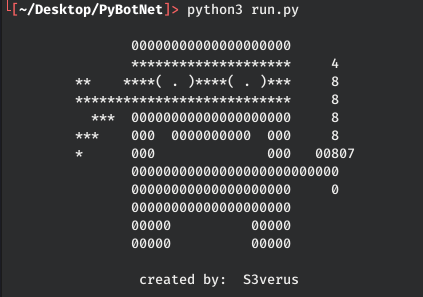

# PyBotNet

create your botnet easy as drinking water! just enjoy it ;)



**[Warning] I do not accept any responsibility for any illegal usage. [Warning]**


### YOU WILL NEED :

- [x] python3
- [x] pip3

### Install Dependencies

```
pip3 install -r requirements.txt
```

### Usage

```
:~# python3 run.py
```

### THIS CAN

- [x] commands execute on targets, linux and windows
- [x] run BackConnect
- [x] clear keys on chrome and Firefox for keyLogger attack, linux and windows
- [x] start keyLogger to listen
- [x] ddos attack to domains
- [x] reboot and poweroff targets
- [ ] kill your enemies, no it can't
  
for more information see manual.html

## Contributing

1. Fork it!
2. Create your branch: `git checkout -b my-new-branch`
3. Commit your changes: `git commit -am 'improve somthings...'`
4. Push to the branch: `git push origin my-new-branch`
5. Submit a pull request :D

### Support this project 

> **Bitcoin wallet:** bc1q966sr0yef0jjwk6mf2rahpggmnxc9kalvd05wc<br>
> **Ethereum wallet:** 0xEBb86542F28c8dD604DD05B3AB1e4F0f49c23a98<br>
> **Litecoin wallet:** ltc1qqde29jzcsm7qklf7vdvxvrd2t9ezw269yz4rze<br>


[](https://twitter.com/thealiabdollahi)

click on heart

